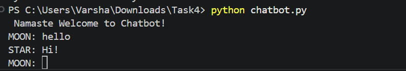

# Basic Chatbot

# Description
A simple chatbot developed using python.

# Features
-> Responds to "hello"
-> Responds to "how are you"
-> Responds to "bye"

# Keyconcepts used
- Functions
- Loops
- If-elif
- Input/Output

# Technologies Used
 python

 #How to Run
 1.Open the projectfolder
 2.Run the python file(python chatbot.py)

 #Screenshot
 

# Author
Varsha Nallamala
